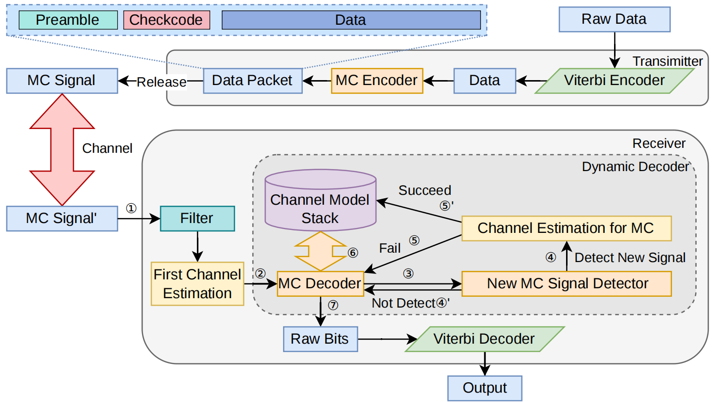

# AdaptMolMAC

`AdaptMolMAC` is a Python codebase for adaptive multi-transmitter molecular communication research, built around the idea that a receiver should not make a single isolated decision and hope for the best, but should instead keep filtering, estimating, remembering, and updating while several transmitters overlap in the same channel 🧪🧬✨ In practice, that means this repository combines channel simulation, transmitter modeling, received-signal processing, preamble-based channel estimation, dynamic multi-link decoding, and error analysis in one place, so it is useful both if you want to understand the method itself and if you want to rerun the experiments that demonstrate how it behaves as interference, payload length, noise, and channel drift all become more challenging 📡💡

## What This Repository Does

At a high level, the repository follows a full end-to-end workflow: a transmitter encodes bits with convolutional coding and a structured packet format, one or more `ChannelModel_Tx` objects generate molecular signals, those signals are superimposed into a shared `yRxData` container, and the receiver side then applies `SignalProcessor`, `StationaryProcessor`, and `DynamicDecoder` to recover the underlying streams 🔬🚀 The important part is that the design is intentionally lightweight on the modeling side while still being adaptive on the decoding side, so instead of trying to fit a huge monolithic model, the code keeps a compact description of the signal shape, tracks residual memory from earlier symbols, and uses that running history to improve later decoding decisions 💙

The main source code lives in `AdaptMolMAC/`, where `models` defines the channel-facing data structures and transmitter logic, `processing` contains the filtering, stationary-point extraction, channel estimation, and dynamic decoding pipeline, `viterbi` contains convolutional encoding and Viterbi decoding helpers, `mcutils` provides logging, plotting, and utility helpers, and `err` contains the accuracy comparison tools 📦✨ Around that core package, `examples/` gives small runnable demos, `docs/usage.md` gives a more API-oriented explanation, `benchmarks/` contains the long-running experiment scripts, and `main.py` provides a simple repository entry point that eventually calls `AdaptMolMAC.cli` 🛠️📘

## Framework Overview



The figure above is the best high-level way to understand how this repository is organized 🧭🧬 At the transmitter side, raw bits are first protected by the Viterbi encoder, then wrapped into a packet that contains `Preamble`, `Checkcode`, and payload `Data`, and in the codebase that idea is reflected by how `ChannelModel_Tx` works together with the configured generator matrix and packet settings before producing an `MC Signal` for release into the channel 🚀 Once one or more transmitters have emitted their signals, the repository superimposes them into a shared received trace through `yRxData`, which corresponds to the `MC Signal'` block in the diagram and gives the receiver a single mixed waveform to interpret rather than a clean per-link observation 🌊 On the receiver side, the first stage is implemented by `SignalProcessor`, which performs baseline handling and filtering through steps such as `process_signal()`, `kalman_filter()`, `adaptive_threshold_filter()`, and `retain_peak_points_filter()`, matching the `Filter` block in the diagram and preparing a cleaner waveform for downstream estimation 🔬 After that, `StationaryProcessor` performs the first preamble-based channel estimate, which is the code-level counterpart of `First Channel Estimation`, giving the system an initial channel model from which decoding can begin 📐 From there the heart of the repository is `DynamicDecoder`, and this is where the diagram becomes especially useful because the decoder is not just reading bits one by one, but repeatedly comparing predicted and observed signal structure, keeping track of already discovered links, deciding whether a residual pattern suggests a previously unseen signal, attempting a new channel estimate when needed, validating candidates with the checkcode logic, and then folding successful estimates back into its running model state 💡 In the picture this state is summarized as the `Channel Model Stack`, and in the code that idea appears as the decoder's maintained collection of channel hypotheses and residual-aware decoding context, which is exactly what lets the framework keep working even when signals overlap, tails linger, and the waveform is distorted by offset drift, amplitude scaling, or interval variation 🔁 Finally, once the dynamic stage has produced `Raw Bits`, the repository runs Viterbi decoding to recover the payload-level output, and benchmark scripts use the emitted markers plus `ErrorDetect` and related evaluation logic to measure how well the whole loop performed under different experimental conditions 📊✨

## Installation

For development, the simplest setup is still to install the project in editable mode with `pip install -e .`, which makes it easy to run the package directly from the repository while you inspect or modify the code 🧰 If you want to build a distribution package, you can install `build` and run `python -m build`. The main dependencies are scientific Python packages such as `numpy`, `scipy`, `matplotlib`, `pandas`, `scikit-image`, `scikit-learn`, and `pykalman`, so the environment is very close to a typical simulation-and-analysis stack rather than a web-service stack 🐍📈

```bash
pip install -e .
```

```bash
pip install build
python -m build
```

## Quick Start

If you want the fastest possible first run, start with `python -m examples.basic_pipeline` or simply run `python main.py` from the repository root 🎯 Both routes lead you into the same general flow: create transmitters, generate overlapping received signals, preprocess the waveform, estimate the first channel from the preamble, and then let the dynamic decoder recover the channel streams. That makes this repository much easier to approach if you think of it as a pipeline instead of a collection of unrelated modules 🌟

```bash
python -m examples.basic_pipeline
```

```bash
python main.py
```

The simplified example below shows the central pattern of use: create a pair of `ChannelModel_Tx` objects, combine their transmissions into one received trace, filter the trace, estimate channel information from the preamble, and then decode with `DynamicDecoder` 🧠✨

```python
import AdaptMolMAC as amm

generator = [
    [1, 1, 1],
    [1, 0, 1],
    [1, 0, 0],
]

tx1 = amm.ChannelModel_Tx(
    interval=17,
    tx_offset=50,
    amplitude=1.0,
    n_preamble=amm.Settings.PREAMBLE_NUM,
    viterbi_gen=generator,
)
tx2 = amm.ChannelModel_Tx(
    interval=22,
    tx_offset=864,
    amplitude=1.0,
    n_preamble=amm.Settings.PREAMBLE_NUM,
    viterbi_gen=generator,
)

y_rx0 = amm.yRxData()
y_rx0 += tx1.transmit("01010011010")
y_rx0 += tx2.transmit("10010011011")

processor = amm.SignalProcessor()
y_rx = processor.process_signal(y_rx0, x_offset=1)
y_rx = processor.kalman_filter(y_rx)
y_rx = processor.adaptive_threshold_filter(y_rx)
y_rx = processor.retain_peak_points_filter(
    peak_points_num=3 + amm.Settings.PEAK_POINT_EXCE_CUT,
    yrx_data=y_rx,
)

stationary = amm.StationaryProcessor(n_preamble=amm.Settings.PREAMBLE_NUM)
channel_info, _ = stationary.estimate_channel(
    y_rx0,
    y_rx,
    interval_dev=0,
    start_pos_dev=1,
)
channel_info.reset_start_pos()

decoder = amm.DynamicDecoder(channel_info.yRx, [channel_info], generator)
decoded_channels = decoder.decode(MAX_SIGNAL_NUM=2)
print(decoded_channels)
```

If you want the API-level walkthrough after that, read `docs/usage.md`; if you want to understand the exact runtime path used by the benchmark scripts, read `AdaptMolMAC.cli`, because that file is where the repository-level execution story becomes most concrete 📘🔍

## The Four Benchmark Parts

The four main experimental parts are directly reflected by the four benchmark scripts in `benchmarks/`, which makes the repository pleasantly easy to navigate once you know what each script is supposed to stress-test 🧭✨ `benchmarks/multi_transmitter_scaling_benchmark.py` is the concurrency-scaling experiment, where the number of active transmitters increases and the code measures how BER and runtime evolve as more links compete in the same molecular channel 🔁 `benchmarks/payload_length_robustness_benchmark.py` is the long-sequence or payload-length robustness experiment, where the question is whether long-memory residual tails keep accumulating badly enough to destabilize decoding as payloads get longer 📏 `benchmarks/tx2_parameter_sensitivity_benchmark.py` is the channel-parameter drift experiment, where `Tx1` stays fixed and `Tx2` is perturbed in `interval`, `offset`, `amplitude`, and pairwise parameter combinations to test how robust the framework remains under realistic waveform variation 🌊 Finally, `benchmarks/snr_interval_tradeoff_benchmark.py` is the SNR-versus-interval experiment, which explores BER, packet loss, and rate tradeoffs in a single-link setting to show the method's lower-level behavior under noise and timing changes 📉⚙️

Because of that one-to-one mapping, this codebase is very readable if you approach it from the perspective of questions rather than files 💭 If your question is “what happens when more transmitters overlap?”, go straight to `multi_transmitter_scaling_benchmark.py`; if your question is “does long memory destroy decoding on long payloads?”, go to `payload_length_robustness_benchmark.py`; if your question is “which parameter drift hurts the most?”, go to `tx2_parameter_sensitivity_benchmark.py`; and if your question is “how does the system behave across noise levels and intervals?”, go to `snr_interval_tradeoff_benchmark.py` 🧡

You can run them from the repository root like this:

```bash
python -m benchmarks.multi_transmitter_scaling_benchmark
python -m benchmarks.payload_length_robustness_benchmark
python -m benchmarks.tx2_parameter_sensitivity_benchmark
python -m benchmarks.snr_interval_tradeoff_benchmark
```

These scripts are not lightweight unit tests; they are long-running research experiments that typically launch repeated runs, collect machine-readable markers from `AdaptMolMAC.cli`, and write CSV summaries for later analysis 📊🧾 So if you run them all at once, expect real compute time rather than a quick smoke-test experience ⏳

## Parallelism And `MAX_WORKERS`

The benchmark scripts support parallel execution by exposing a `MAX_WORKERS` variable near the top of each file, and this is the main knob you should change if you want to use more or fewer CPU resources 🔧🔥 In other words, when you want to adjust the maximum parallel worker count, you should change `MAX_WORKERS` directly rather than hunting for some hidden scheduler. The naming is now unified across the benchmark scripts, so `multi_transmitter_scaling_benchmark.py`, `snr_interval_tradeoff_benchmark.py`, and `tx2_parameter_sensitivity_benchmark.py` all use the same `MAX_WORKERS` setting 🚦 This makes the parallelism control much easier to understand and much easier to tune consistently across experiments.

If your machine has more cores and you want faster throughput, increase the relevant worker value 🚀 If you want a safer run that avoids saturating CPU or memory, lower it a bit 🫶 This is especially useful for the heavier benchmark loops, where increasing parallelism can cut total runtime significantly, but also make debugging or log inspection noisier.

## Suggested Reading Order

If you are new to the repository, the smoothest reading order is to start with `examples/basic_pipeline.py`, then open `AdaptMolMAC.cli`, then read `docs/usage.md`, and only after that dive into the benchmark scripts 📚✨ That sequence makes the repository feel much less overwhelming, because you first see the minimal pipeline, then the actual runtime orchestration, then the API descriptions, and only then the longer experimental wrappers. By the time you reach the benchmark files, you already know which parts are signal generation, which parts are filtering, which parts are channel estimation, and which parts are dynamic decoding, so the experiment logic becomes much easier to follow 🧠💫

## Summary

`AdaptMolMAC` is best understood as an adaptive decoding framework for overlapping molecular communication signals, implemented as a research-oriented Python repository that connects method, runtime pipeline, and experiment scripts in a very direct way 🧬💻 If you want to reproduce experimental behavior, spend most of your time in `benchmarks/`; if you want to understand how the system actually works, focus on `examples/`, `AdaptMolMAC.cli`, and the modules under `processing/` and `models/` 🌈
